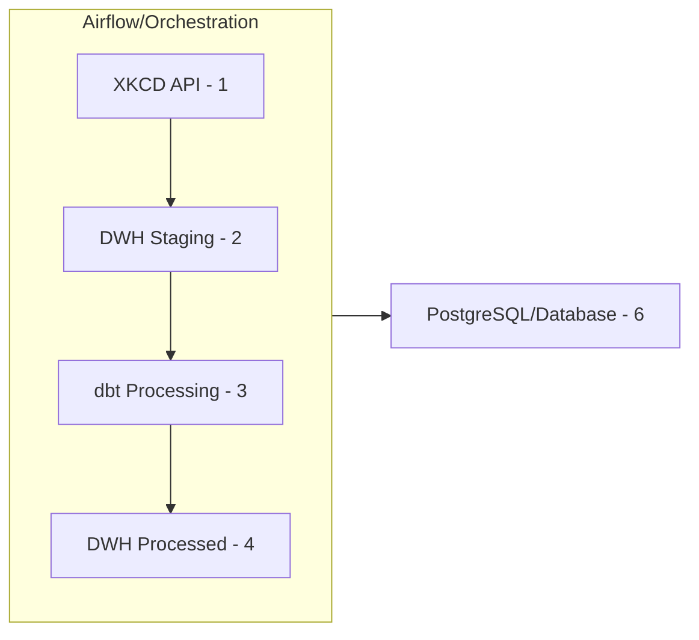
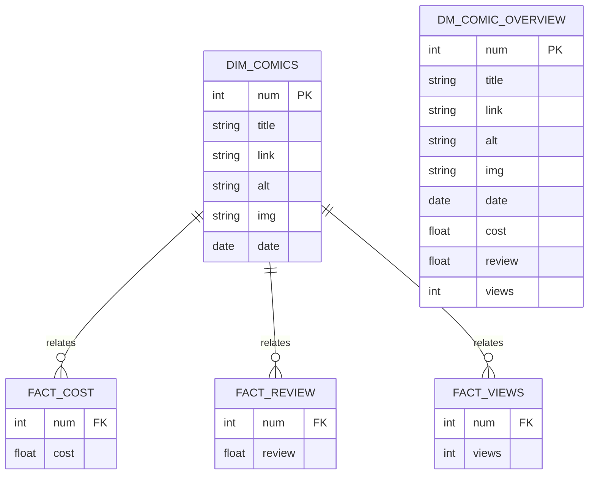
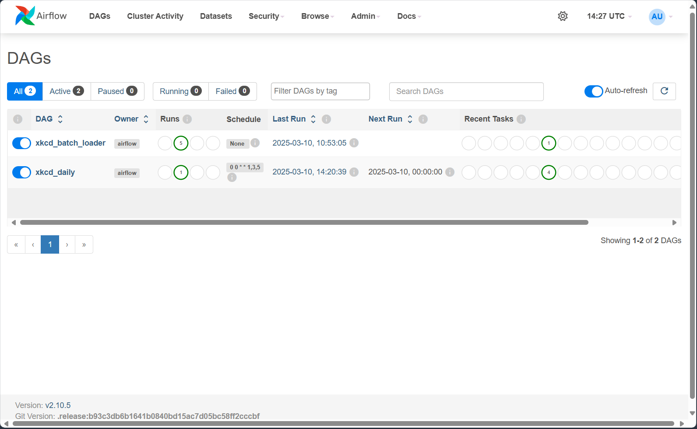
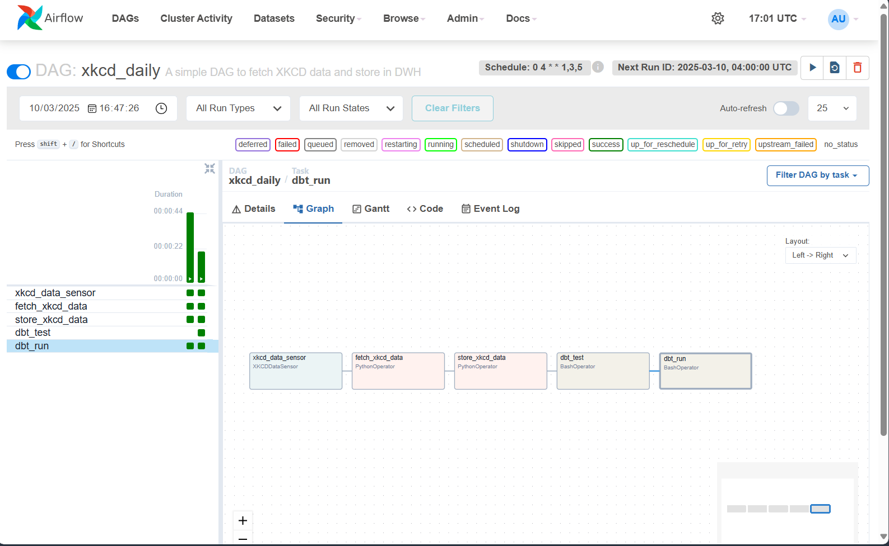

# Batch Processor
This demo fetches data through the API provided by XKCD and uses Airflow and dbt to transform the raw data into a model. 
Based on this, it's possible to gain valuable insights on costs, reviews, views, and other trends.

## Overview

This diagram provides a high-level overview of the data pipeline architecture:

1. **XKCD API**: This component represents the source of the data, which is the XKCD API. It is responsible for providing the raw data that will be processed.

2. **DWH Staging**: This is the staging area in the Data Warehouse (DWH) where the raw data from the XKCD API is initially loaded. It serves as a temporary storage before further processing.

3. **dbt Processing**: dbt (data build tool) is used for transforming the data. In this stage, the raw data from the staging area is processed and transformed into a more usable format.

4. **DWH Processed**: This represents the final processed data stored in the Data Warehouse. The data is now ready for analysis and reporting.

5. **Airflow/Orchestration**: Apache Airflow is used for orchestrating the entire data pipeline. It schedules and manages the workflow, ensuring that each step in the pipeline is executed in the correct order.

6. **PostgreSQL/Database**: PostgreSQL is the database system used to store both the staging and processed data in the Data Warehouse.

## Features
- **Data Orchestration**: Utilizes Apache Airflow to fetch data idempotently and orchestrate dbt workflows.
- **Data Transformation**: Employs dbt to transform raw data into meaningful models.
- **Testing**: Runs tests on data models before processing to ensure data integrity.
- **Data Warehouse**: Stores transformed data in a PostgreSQL data warehouse.
- **Insights**: Provides valuable insights on costs, reviews, views, and other trends from the transformed data.

## Installation
You can use devcontainers in VSCode for a consistent development environment. Follow these steps:

1. Install the [Remote - Containers](https://marketplace.visualstudio.com/items?itemName=ms-vscode-remote.remote-containers) extension in VSCode.
2. Open the repository in VSCode.
3. When prompted, reopen the repository in a container.

If you don't want to use devcontainers, you can also run the `docker-compose.yaml` file directly. I found it faster
to develop dbt models in the devcontainers.

I've written two dags, one to do the initial load (starting at comic number 2500, set by an Airflow variable) and
one that is used for a daily load. This is scheduled at 4 am CET because a new comic will probably added a bit later
during the day since I think XKCD is an American. This dags waits for the data to be present, loads the data and
afterwards runs `dbt test` and `dbt run` to make sure the data is made available in the DWH.

### Initial run
For the initial run it's important to run the `daily` DAG first and afterwards the `batch`. This
way all the schema's and cross dependencies are created correctly.

Username and password for Airflow is `admin`, `admin` and it can be reached at [http://localhost:8080/home](http://localhost:8080/home).

Furthermore I used `pdfLaTeX` to have a version controlled presentation. You can generate it
yourself based on the Tex file (I have included the Tex Preview plugin in the dev container).

## ER diagram
The entity relationship diagram is fairly simple. We are using a fairly standard dimensional model and not much
transformations are needed. The source basically only contains the dimension and the facts are dummies
generated as dbt models. 

This allows us to gain valuable insights. By analyzing the costs, reviews, and views for each comic, 
we can uncover interesting relationships and trends.

[//]: # (Live editor: https://mermaid-js.github.io/mermaid-live-editor)

## Data quality checks
I only implemented very simple data quality checks on the primary ID column (num) to 
make sure it is not `NULL` and unique. I have added another check to see if the row counts
still match after the transformations (something that is very important to check).

## Screenshots
DAG overview in Airflow

The daily load DAG:

## Possible improvements
- **Enhanced Data Quality Checks**: Implement more comprehensive data quality checks, such as verifying data ranges, checking for duplicates, and ensuring referential integrity.
- **Error Handling and Logging**: Improve error handling and logging mechanisms within the Airflow DAGs to better capture and diagnose issues during data processing.
- **Scalability**: Optimize the data pipeline to handle larger volumes of data and improve performance.
- **Monitoring and Alerts**: Set up monitoring and alerting to notify the team of any issues or anomalies in the data pipeline.
- **Data Lineage**: I did not spend time on implementing the `dbt docs` routine to automatically generate an interactive document in html. A next step could be to
implement this and host it on a webserver.
- **Advanced data insights**: Think of more advanced transformations and generate better insights.

## Troubleshooting
It could be that the permissions on some of the `dbt` project files are not set correctly. I tried
to force UID 1000 for both Airflow, dbt and the .devcontainer to make sure that after dbt
compilation all files are set to the correct user, known across all containers. In practice I saw
this sometimes fails (something to fix in the long run). For now a quick fix would be to log in
to the dbt container and `chmod -R 777 /dbt`. Which is not very nice but it works.